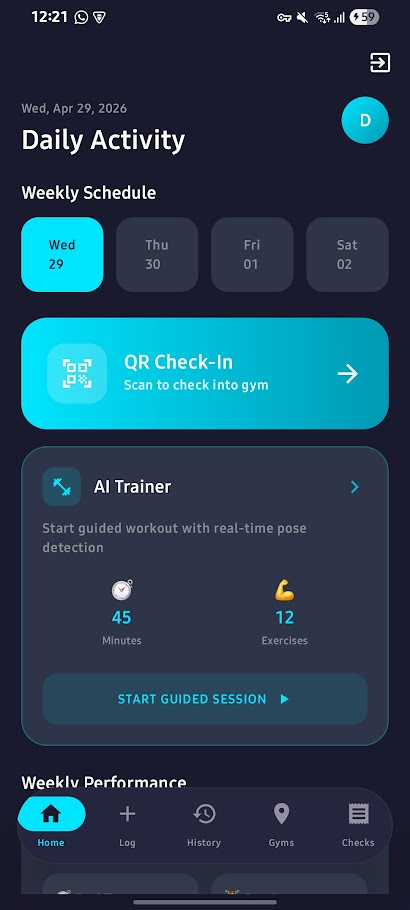
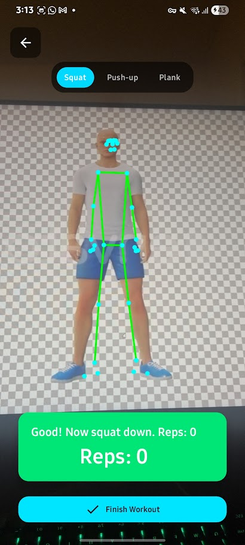
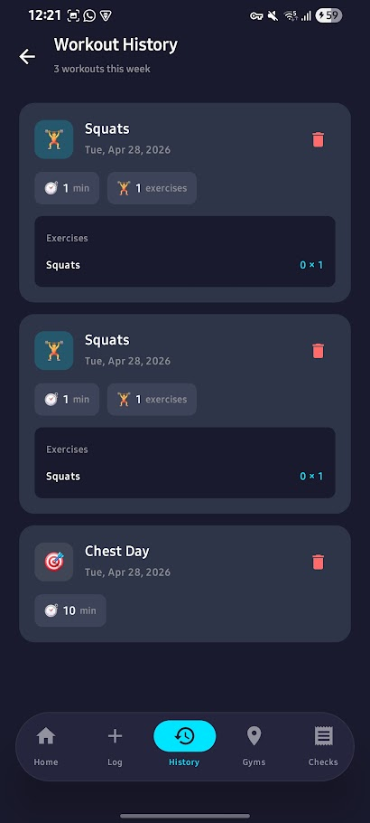

# VitaGym 🏋️

VitaGym is a modern Android fitness application designed to help users track their workouts, log gym check-ins, and manage their fitness journey. Built with Jetpack Compose and Firebase, it offers a seamless, responsive, and visually stunning user experience with a high-contrast dark theme.

## 📸 App Preview

| Dashboard | AI Trainer | Workout History |
| :---: | :---: | :---: |
|  |  |  |

## ✨ Features

### 🔐 User Authentication
- **Secure Access**: Login and registration powered by **Firebase Authentication**.
- **Google Sign-In**: Quick one-tap access for a seamless onboarding experience.
- **Data Privacy**: Complete data isolation using user-scoped Firestore security rules.

### 🤖 AI Trainer (Real-time Analysis)
- **Pose Detection**: Uses **Google ML Kit** to analyze body posture in real-time.
- **Automated Rep Counting**: Smart state-tracking logic to count Squats and Push-ups automatically.
- **Form Feedback**: Instant visual feedback on exercise depth and core alignment to prevent injury.
- **Privacy-First**: Video processing happens entirely on-device; no recordings are stored or uploaded.

### 📊 Workout & Progress Tracking
- **Interactive Dashboard**: View "Daily Activity" at a glance with a custom weekly schedule.
- **Performance Metrics**: Real-time tracking of total workout time, exercises completed, and rep counts.
- **Manual Logging**: Easy-to-use interface for logging custom sessions or predefined routines.
- **History Management**: Comprehensive workout log with color-coded summaries and deletion support.

### 🏢 Gym Check-In System
- **QR Integration**: Instant gym check-in via QR code scanning (`GYM_ID|Gym Name`).
- **Activity Log**: Keep track of all gym visits with automated timestamps.

### 🎨 Premium UI/UX
- **Floating Navigation**: A modern, pill-shaped persistent bottom bar for quick multitasking.
- **Fluid Motion**: Professional horizontal slide and fade transitions between all screens.
- **Splash Screen**: Custom animated launch experience that matches the app's dark aesthetic.

## 🔒 Privacy & Data Security

Privacy is a core pillar of VitaGym. We use advanced on-device processing to ensure your data stays yours:
- **On-Device AI**: All pose detection and form analysis are performed locally on your smartphone.
- **Zero Video Storage**: Raw camera frames are processed in volatile memory and immediately discarded. VitaGym **never** records, stores, or transmits your video or images.
- **Metadata Only**: Only numeric workout statistics (reps, duration, date) are saved to your secure Firebase profile.

## 🛠️ Tech Stack

- **UI**: Jetpack Compose (Material 3)
- **Language**: Kotlin 100%
- **Backend**: Firebase (Auth & Firestore)
- **AI/ML**: Google ML Kit (Pose Detection & Barcode Scanning)
- **Camera**: CameraX
- **Architecture**: MVVM + Repository Pattern
- **Logging**: Timber

## 🚀 Getting Started

1. **Firebase Setup**: Add your `google-services.json` to the `app/` folder.
2. **Firestore Rules**: Deploy the security rules found in the documentation to your Firebase console.
3. **Indexes**: Click the auto-generated links in Android Studio's Logcat to create the required composite indexes for sorted queries.

---

**Made with ❤️ for fitness enthusiasts**
